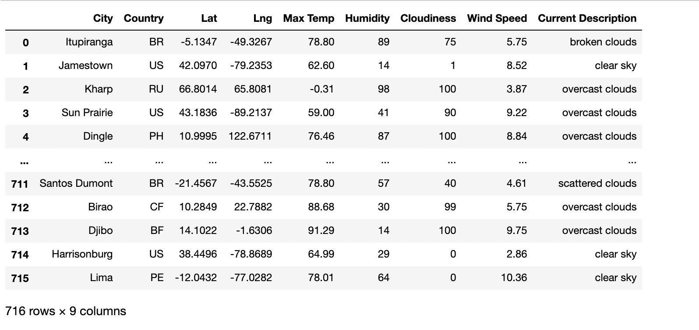
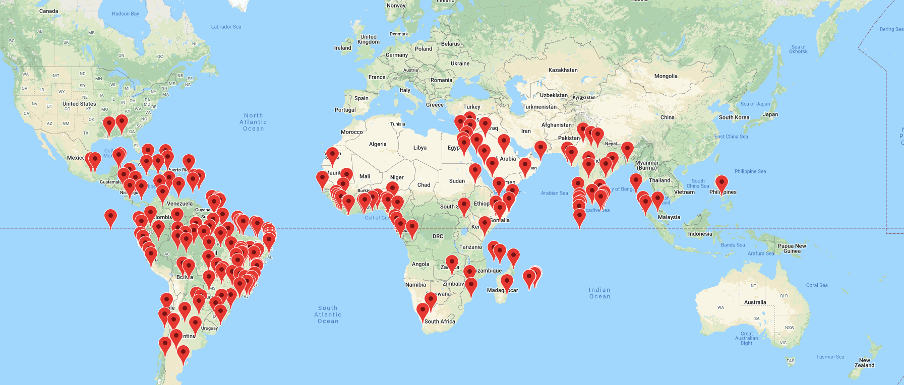
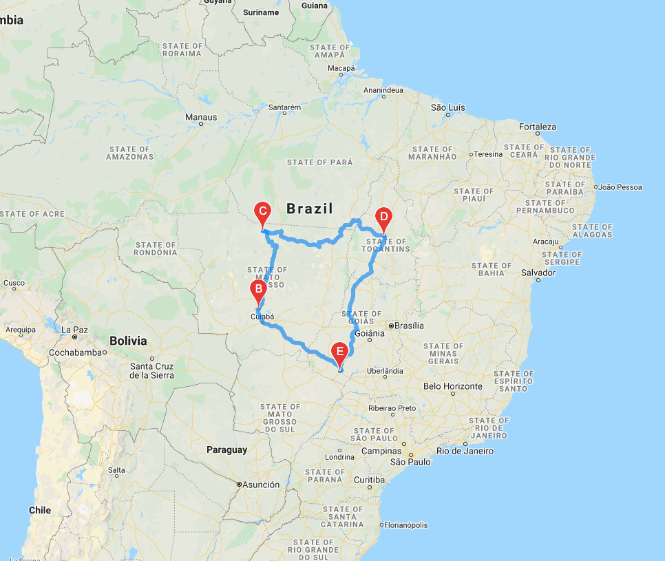
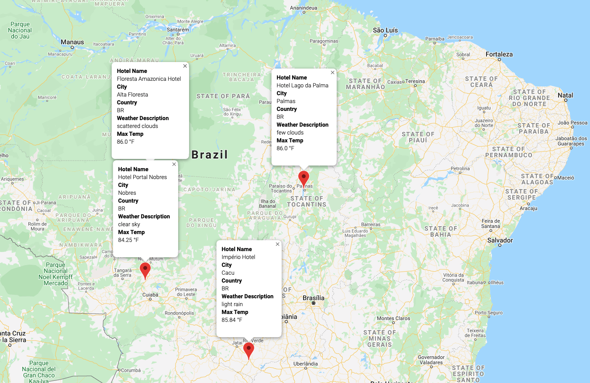

# World_Weather_Analysis
Weather Analysis and building of a travel app for customers of 500+ cities around the world.
## Overview

This analysis looks at different weather patterns around the global and offers insights to travelers who want to book a trip. There are three folders here that offer different levels of analysis: 
- ### Weather Database
- ### Vacation Search
- ### Vacation Itinerary.

## Weather Database

This folder uses Open Weather Map API to pull weather information on over 716 different cities around the world. That information consists of:

1. ### Maximum Temperature
2. ### Humidity
3. ### Cloudiness
4. ### Wind Speed
5. ### Current Weather Description

These different categories of information make it easy for travelers to choose exactly what they are looking for in a travel destination.

### Vacation Search

This folder takes the information gained in the weather database and uses Google Maps API to plot different travel destinations with a hotel at each location. For example, the image below shows the locations of all the places in the database that have an daily maximum temperature between 75 and 90 degrees farinheit.

### Vacation Itinerary

This folder takes the search information from the Vacation Search folder and uses Google Maps directions API to create a vacation itinerary. For example, the image below shows a 4 stop itinerary in Brazil that features Cacu, Nobres, Alta Floresta and Palmas.

Also, as with the vacation search folder, there is a hotel at each location. See below map showing Hotel Information.

### Bonus: Weather Data

As an addon to these three folders, there is a weather data folder that has valuable linear regression models looking at the correlation between different weather infromation and latitude. These take into consideration the different weather information that are used in the weather database folder. 

